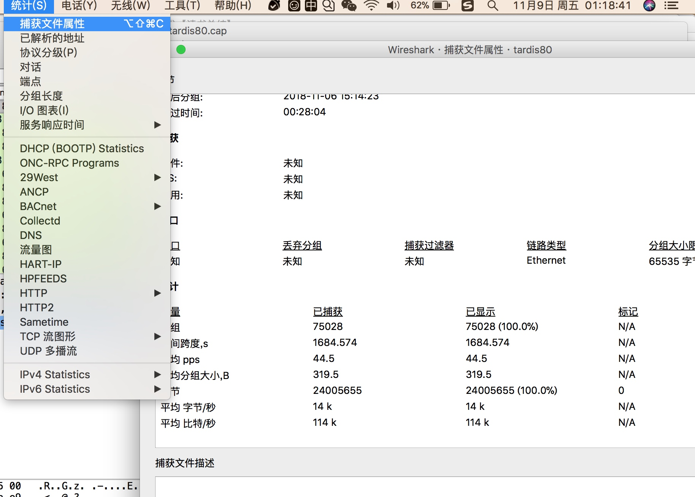
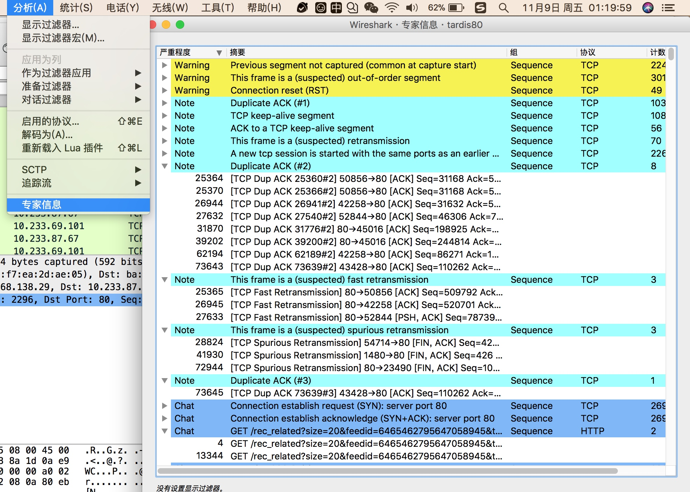

[TOC]

# Wireshark分析艺术【读书总结】

## 一，Wireshark实战操作

### 界面的操作分析

#### 三板斧之一：查看统计、属性信息
性能分析三板斧之一：

【统计->捕获文件属性】
Statistics -> Capture File Properties，查看文件属性信息，如平均速度、包大小、包数等等

判断流量高低峰、是否过载





#### 三板斧之二：查看分析专家信息
性能分析三板斧之二：

【分析->专家信息】
Wireshark ->Analyze -> Expert Infomation -> Notes，查看抓包的统计信息

查看是否有Notes、Warnings、errors之类的信息，看看是否有相关警告和错误，判断网络质量、重传乱序等




#### 三板斧之三：查看服务响应时间
性能分析三板斧之三：

【统计->服务响应时间】
statistics -> Service Response Time -> xxxxx（如：ONC-RPC -> Program:NFS）

查看各项操作的服务响应时间，判断是否过载


#### 将seq使用相对值来替代真实值
Edit->Preferences->Protocols->TCP,勾选 Relative Sequence Numbers

启用之前就是相对值了。

#### 查看TCP StreamGraph

Statistics -> TCP StreamGraph -> TCP Sequence Graph（Stevens）

查看数据传输情况，如传输的是否均匀、是否有TCP Zero Windows之类的


Statistics -> Flow Graph，然后，在弹出的界面中的 Flow type 选择 TCP Flows，你可以更清晰的看到，整个过程中 TCP 流的执行过程


### 字段含义&提示信息
字段含义就是wireshark的一些提示信息,也就是wireshark抓包的一些info信息，这些提示信息都是Info这一栏中体现。

#### 1，[Packer size limited during caputre]
如果某个包被标记提示```[Packer size limited during caputre]```，说明这个包没有抓全，可以进一步查看下面的frame信息。一般这个情况是抓包的姿势不对。某些操作系统中，tcpdump默认只抓取每个帧的前96个字节，因此tcpdump抓包的时候，可以通过 -s参数指定要抓取的字节数

#### 2，[TCP ACKed unseen segment]
如果wireshark发现被Ack的那个包没有抓到，就会提示```[TCP ACKed unseen segment]```，不过这个提示大部分情况都可以忽略。因为大都情况下，刚开始抓包的时候，都是只抓到了后面的Ack而没有抓到前面的ACK

#### 3，[TCP Previous segment not captured]

TCP数据传输中，除了三次握手和四次握手之外，同一台机器发出的数据段应该是连续的，即后一个包的Seq等于前一个包的Seq+Len，正确情况都应该是这样；如果发现后一个包的Seq大于前一个包的Seq+Len，那么就说明中间丢了一段数据，如果丢失的数据在整个网络包中都找不到，wireshark就会提示```[TCP Previous segment not captured]```，

出现这种情况的两个可能性：

* 数据包真的丢了
* 数据包并没有真丢，只是抓包工具漏掉了
    * 如果确认Ack包中包含了没有抓到的包，那就是抓包工具漏掉了，否则就是真丢了

#### 4，[TCP Out-of-Order]
TCP数据传输中，除了三次握手和四次握手之外，同一台机器发出的数据段应该是连续的，即后一个包的Seq等于前一个包的Seq+Len，正确情况都应该是这样；或者说后一个包的Seq应该会大于等于前一个包的Seq+Len，如果wireshark发现后一个包的Seq小于前一个包的Seq+Len，那么就认为是乱序了，就会提示```[TCP Out-of-Order]```。

一般而言，小跨度的乱序影响不大，如果是大跨度的乱序则会导致快速重传。举例如下，如果一个包的顺序是1、2、3、4、5被打乱成2、1、3、4、5则属于小跨度乱序，影响不大；如果被打乱成2、3、4、5、1，则会触发足够多的Dup ACK，从而导致1号包的重传。

#### 5，[TCP Dup ACK]
当乱序或者丢包发生时，接收方就会收到一些Seq号比期望值大的包，TCP协议每收到一个这种包就会ACK一次期望的Seq值，通过这个方式告知发送方，因此就产生了一些重复的Ack。Wireshark抓到这些重复的Ack就会提示```[TCP Dup ACK]```.

#### 6，[TCP Fast Retransmission]
当发送方连续收到3个或者以上```[TCP Dup ACK]```时，就意识到之前发的包可能丢了，于是根据RFC的规定就会开始快速重传。```[TCP Dup ACK]```是接收方回应给发送方的，因此发送方就能够感知到并当连续收到3个以上的时候就开启快速重传。

快重传算法规定，发送方只要一连收到3个重复确认就应当立即重传对方尚未收到的报文段，而不必继续等待设置的重传计数器时间到期。 

#### 7，[TCP Retransmission]
如果一个包真的丢了，又没有后续包可以在接收方触发[Dup Ack]，那么就不会开启快速重传，这种情况发送方只能等到超时后再发送重传，超时重传的包就会被wireshark标记并提示```[TCP Retransmission]```

TCP 超时与重传应该是 TCP 最复杂的部分之一，超时重传是 TCP 保证可靠传输的基础。当 TCP 在发送数据时，数据和 ack 都有可能会丢失，因此，TCP 通过在发送时设置一个定时器来解决这种问题。如果定时器溢出还没有收到确认，它就重传数据。关键之处就在于超时和重传的策略，需要考虑两方面：

* 超时时间设置
* 重传的频率（次数）

在 Linux 较高的内核版本中，比如 3.15 中，已经有了至少 9 个定时器：超时重传定时器，持续定时器，ER延迟定时器，PTO定时器，ACK延迟定时器，SYNACK定时器，保活定时器，FIN_WAIT2定时器，TIME_WAIT定时器。


#### 8，[TCP zerowindow]
TCP包中“win=xxx”代表接收窗口的大小，表示这个包的发送方当前还有多少缓冲区可以接受数据。当wireshark发行一个包中的“win=0”时，就会标记提示```[TCP zerowindow]```，表示缓冲区已经满了，无法再接收数据了。

一般的，在缓冲区满之前，窗口大小应该是逐渐减小的过程。

#### 9，[TCP window Full]
如果一个包的发送方已经把对方所声明的接收窗口大小耗尽了，就会被wireshark标记为```[TCP window Full]```。比如某一端在握手时声明自己的接收窗口只有65535，也就意味着对端最多只能给他发送65535字节的数据而无需确认，即“在途字节数”最多只能是65535，当wireshark计算出对端已经有65535字节未被确认时，就会发生这个提示。


[TCP window Full]和上面的[TCP zerowindow]比较容易混淆，前者表示这个包的发送方暂时没有办法再发送数据了；后者表示这个包的发送方没有办法再接收数据了；两者都会意味着要暂停数据传输

#### 10，[TCP segment of reassembled PDU]
只有在Edit->Preferences->Protocols->TCP菜单里启用了```Allow sub dissector to reassemble TCP streams```后，才有可能收到这个提示。这个表示可以把属于同一个应用层PDU的TCP包虚拟的集中起来

#### 11，[Continuation to #]
只有在Edit->Preferences->Protocols->TCP菜单里关闭了```Allow sub dissector to reassemble TCP streams```后，才有可能收到这个提示。

#### 12，[Time-to-live-exceeded(Fragment reasembly time execeeded)]

（Fragment reasembly time execeeded）表示这个包的发送方之前收到了一些分片，但是由于某些原因导致迟迟无法组装起来。

比如传输过程中有一些分片被丢包了，那么接收方就无法组装起来，然后就通过这个ICMP的方式告知发送方


ICMP是（Internet Control Message Protocol）Internet控制报文协议。它是TCP/IP协议族的一个子协议，用于在IP主机、路由器之间传递控制消息。控制消息是指网络通不通、主机是否可达、路由是否可用等网络本身的消息。这些控制消息虽然并不传输用户数据，但是对于用户数据的传递起着重要的作用。


 
## 二，Wireshark分析TCP协议

### TCP抓包协议基础
#### TCP控制字段
在TCP层，有个FLAGS字段，这个字段有以下几个标识：SYN, FIN, ACK, PSH, RST, URG.

抓包显示的控制字段形态如下：

[SYN] ： 建立连接、发起包
[FIN] ： 关闭连接、结束包
[PSH] ： DATA数据传输
[ACK] ： ACK回应
[RST] ： RESET、连接重置

另外两个常用字段：

[Len] ：数据包长度
[Seq] ：数据包序列号

ACK是可能与SYN，FIN等同时使用的，比如SYN和ACK可能同时为1，它表示的就是建立连接之后的响应，如果只是单个的一个SYN，它表 示的只是建立连接

当出现FIN包或RST包时，我们便认为客户端与服务器端断开了连接
当出现SYN和SYN＋ACK包时，我们认为客户端与服务器建立了一个连接

#### 抓包方向（client or server）
* 抓包的时候，不管是通过wireshark抓包，还是通过tcpdump抓包，都需要看看是从客户端方向抓包，还是从服务端方向抓包，不同的方向，抓包的情况完全不一样，因为网络（公网、实际环境）上有很多异常情况发生。

#### TCP的Ack
对应http而言，一般就是request->reponse，一问一答。但对应TCP而言，并不一定每个包都会ACK。TCP的ACK是一种累积的ACK，也就是表示在我这个ACK之前的所有其他ACK都已经确认收到了。

比如，97号包的ACK=65701，96号包的Seq+Len=64273+1428=65701，那么就是表示97号的ACK是对96号的回应，也就是96号之前的其他没有被显示ACK的包，其实都已经通过97号包ACK了，这样发送方也就知道了在96号之前发出去的所有包对方都已经收到并ACK了。

#### MSL、TTL、RTT、RTO

* MSL（Maximum Segment Lifetime），表示“报文最大生存时间”，是所有报文都遵循的在网络上存在的最长时间，超过这个时间报文将被丢弃
    * RFC 793中规定MSL为2分钟，实际应用中常用的是30秒，1分钟和2分钟等。
    * 2MSL即两倍的MSL，TCP的TIME_WAIT状态也称为2MSL等待状态
 

* TTL（Time to live），表示生存时间，是ip头的一个域，生存时间是由源主机来设置一个初始值，但TTL不是存的具体时间，而是表示可以经过的最大路由数。
    * 根据RFC 1812，一个网络包的TTL每减去1就表示它经过一次路由。一般TTL的初始值为64，如果某个ACK包的TTL是62，则意味着是是距离此设备两跳的设备发出来的。
    * TTL在wireshark抓包中的形态如``` Time to live: 62```
    * TTL=0则数据报将被丢弃，同时发送ICMP报文通知源主机
    * 一般在缓存、连接心跳中也用到TTL这个，他们和TCP协议中的TTL是有区别的，缓存、连接心跳中的TTL表示的就是数据缓存or剩余的时间。
    
* RTT（round-trip time），表示客户到服务器往返所花时间，TCP含有动态估算RTT的算法
    * TCP会持续估算一个给定连接的RTT，因为RTT受网络传输拥塞程序的变化而变化


#### MAC地址解析

Protocol = ARP
Source 和 Destination 都是MAC地址格式如 00:60:48:ff:12:31


抓包分析中，如果网络不通，发出去收不到ACK等等之类的，要再进一步看看每个包的MAC地址是否正确，反之有多个MAC地址导致的一些问题


### TCP握手和挥手协议

#### TCP三次握手&判断回包

* 三次握手协议
    * client->server : [SYN] Seq=X  win=xxx Len=0 MSS=xxx
    * server->client : [SYN, ACK] Seq=Y，ACK=X+1 win=xxx Len=0 MSS=xxx
    * client->server : [ACK] Seq=X+1，Ack=Y+1 win=xxx Len=0

* 抓包数据，如何判断一个包是上一个包的回包呢？根据TCP协议，下一个包的Ack的值如果等于上一个包的Seq + Len，则表示是其回包
    * 上一个和下一个，很多情况下并不是连续的，也行下一个回包距离上一个包已经过了很多包了，因为重传、延迟的原因的

    * seq 173:182，表示seq是一个范围区间，然后对应的ack，要是区间最后一个值182，表明就是对此seq的一个ACK

    * seq表示这个包的序号，是按tcp包内数据字节长度加上当前 seq 得到，如包内数据是21字节，而当前IP1发到IP2的包的seq是10的话，那下个IP1发到IP2的包的seq就是10+21=31。而 ack 表示的是期望的对方（接收方）的下一次sequence number是多少；因此这个A 给 B 发的包，B 回应的 ACK 就是 seq + len； 然后 A 再次给 B 发的包，的 seq 就是 B 的这个 ACK。


* 三次握手的时候会相互声明各自的MSS

#### TCP四次挥手&三次挥手

* TCP四次挥手协议
    * client->server : FIN Seq=X，ACK=Y
    * server->client : Seq=Y，ACK=X+1
    * server->client : FIN Seq=Y，ACK=X+1
    * client->server : Seq=X+1，Ack=Y+1

* 正常而言，都会有这样的四次挥手，但是如果有延迟确认，那么四次挥手就变成了3次挥手，省掉了四次挥手中的第二个包
    * client->server : FIN Seq=X，ACK=Y
    * server->client : FIN Seq=Y，ACK=X+1
    * client->server : Seq=X+1，Ack=Y+1


### TCP拥塞控制算法

已经发出去，但是还没有接收到ACK的，都会一直保存在缓冲中


#### 在途字节数

* 在途字节数【bytes in flight】，表示的是已经发送出去，但是还没有被确认的字节数，这个确认指的是对端发出ACK确认，这个就是所谓的网络承载量；如果在途字节数超过网络承载量，那么就会发生丢包重传
    *  在途字节数 = 当前发送方的【Seq + Len】 - 当前接收方的【ACK】
        * 这个“当前”仅仅从抓包上的网络包序号去看就可以了，并不需要这两个包有什么关系，也正因为这两个包没有关系，所以才是计算出在途字节数的方式
        * 这个Len，一般而言，不应该超过TCP的MSS（最大数据字段），这个值是1388，注意对比MTU（1500）

#### 网络拥塞

* 网络拥塞点：超过网络承载量而导致的网络拥塞。发生拥塞时的在途字节数就是该时刻的网络拥塞点，估算网络拥塞点只需要简单找到拥塞时的在途字节数即可
    * 拥塞的特征就是连串的丢包、丢包后又会重传；wireshark、tcpdump等抓包工具可以标识出重传包
    * 根据抓包工具，找到一连串重传包中的第一个包，然后根据该包重传的Seq值找到对应的原始包，最后，计算该原始包发送时刻的在途字节数，这个就标识当前的拥塞点
        * 假如Seq+Len-Ack = 103122，这个单位表示字节，也就是100KB，这个100KB就是最大的发送窗口，因此需要设置Linux系统中发送窗口的值
    * Wireshark ->Analyze -> Expert Info -> Notes菜单可以看到重传统计
    * 通过在途字节数只是估算 网络拥塞点，并不一定很精确，可以采样多次然后找到合适的值；多次采样后的数据，其实保守的话应该取最小值而不是平均值
        * 取最小值是因为这样最保守，这样才能真正保证网络不会拥塞；取完之后要设置Linux的发送窗口
    * 前面有说的，数据包的Len最大不应该超过1388，但是实际抓包分析过程中，却会发现实际的Len可能是1338的两倍或者N倍，这个是什么原因呢？ 这是因为有一个所谓的LSO。
    * 一般网络工作方式是：应用层把产生的数据交给TCP层，TCP再根据MSS大小进行分段，分段由CPU负责进行，最后再交给网卡
    * 如果启用了LSO：TCP层就把大于MSS的数据块直接交给了网卡，让网卡去负责分段工作。
        * 从发送方的视角，相当于是站在了CPU视角，这样抓包看到的应该是分段前的打包。从接收方视角，相当于是站在了网卡视角，那么看到的就应该是分段后的多个小包
        * LSO出现的意义在于目前网卡经常是千兆、万兆，这样CPU的负担很重。比如625MB/s的网络流量大约需要耗费5GHz的CPU，因此为了缓解CPU的负担，就把一些分段的工作直接交给网卡去执行了，


一些实战经验告诉我们，```Wireshark ->Analyze -> Expert Info -> Notes```统计中的重传率如果超过了0.1%，就需要采取一些措施了。但是现实网络环境下，要低于0.01%的重传是基本不可能的。

#### 拥塞窗口

拥塞窗口 cwnd
接收窗口 rwnd
发送窗口 = min（cwnd、rwnd）

#### 发送窗口、接收窗口

* 客户端发送窗口的两个因素：网络上的拥塞窗口（cwnd）和服务器上的接收窗口
    * cwnd的增长方式是：先“慢启动”、再进入“拥塞避免”，前者起点低但是能够快速增长、后者起点高但是每一个RTT只能增加一个MSS（RTT指往返时间，也就是到了下一个从同一个方向传输的包）
   
    * 根据抓包的数据，点开详情，查看其“Bytes in flight”值，可以简单等同与cwnd
        * 如果是“慢启动”阶段，那么下一个RTT的包的cwnd应该要远远大于上一个包的cwnd
        * 如果是“拥塞避免”阶段，那么下一个RTT的包的cwnd应该要增加一个MSS（以太网中的MSS约为1460字节）。
        * 如果不符合上述两种情况，比如cwnd增长的非常慢，那么就需要根据cwnd的计算方式去分析了
        


### 数据包分片、MTU、MSS

#### 数据包分片和重组

分组交换，把大的数据分割成小包，这样可以实现链路共享，而不至于因为某一方阻塞所有。既然要分割成小包，那么必然要确定一个最大的包大小，这个就是MTU（Maximum Transmission Unit）最大传输单位，值为1500字节。如果除去20个字节的包头结构，那么一个IP包最大的包大小为1500-20=1480字节。如果要传输的数据块超过1480字节，那么网络层就会将其分片处理，封装为多个网络包传输。对于TCP而言，TCP协议层会主动把数据分成小段后再交给网络层，TCP的最大分段大小称之为MSS（Maximum Segment Size），这个MSS被设置为MTU减去IP头和TCP头之后的大小，这样刚好可以满足一个MTU。因为UDP没有MSS的概念，因此就只能交给网络层去处理分片了。


但是需要注意的是，目前有些网络是Jumbo Frame（巨帧）或者PPPOE这样的设备，那么他们的MTU则不是1500字节。目前发送方并没有一个好的机制来确定最佳分片大小，应该尽量使得网络中的设备的MTU保持一致。如果网络中的设备的MTU不一致，那么TCP协议如何适配MTU呢？我们知道TCP建连的时候必须要先进行三次握手，TCP在前两个握手包中会相互声明自己的MSS。如果client端声明自己的MSS=8960（巨帧），server端申明自己的MSS=1460，那么client在三次握手后就知道了server端的MSS，因此当client想要发送大于server端MSS的包的时候就会主动将自己的MSS降低为server端的MSS大小，从而适配接收方的MTU，可见，TCP协议层做了非常多的优化和处理


既然有分片，那么接收方必然要进行分片重组，通过抓包工具可以得知，分片的每个包都包含了```off=xxx，ID=xxx```这样的信息，接收方会把ID相同的分片按照off偏移量进行重组。那么接收方又如何得知那个包才是最后的分片呢？然后什么时候开始重组呢？这里就在于最后一个分片包有一个特殊的Flag，叫```More fragment = 0```，抓包中的表现形式是```..0. ... = More fragment: Not set```，这个就表示它是最后一个分片，然后可以开始重组包了。如果是其他分片包，形如```..1. ... = More fragment: set```则表示接收方需要缓存，等待其他分片传输完成


#### MTU的实战

如果client端的MTU=9000，server端的MTU=1500，那么当client请求server端的时候，client的包经过路由器时候，要么就被丢包，要么就被分片。如果这个巨帧包在网络层携带了DF（Don't fragment）标志则被丢弃（设置则表示不允许分片），如果没有设置则进行分片传输。需要注意的是，这种情况下如果丢包了重传还是会被丢弃，就成了黑洞了。

测试中，可以通过ping命令模拟这样的情况：

```
成功：
ping xxx.xxx.xxx.xxx -l 1472 -f -n 1 

失败：
ping xxx.xxx.xxx.xxx -l 1473 -f -n 1 
```

-f 参数表示设置DF标志
-l 参数表示请求字节

当请求字节设置为1472的时候，因为ICMP头部为8字节、IP头为20字节，因此1472+8+20=1500，刚好是一个MTU，因此可以ping成功。但是第二个1473+8+20=1501字节超过MTU了，又因为设置了DF标志表示不允许分片，因此传输失败，一般这样的情况下，路由器会回复```Packet needs to be fragmented but DF set```。


抓包的时候，如果发现一直重传，某个某些相对较大的包（查看Len值）才重传，那么可以通过```ping xxx.xxx.xxx.xxx -l [Len] -f ```值进行测试验证，通过这个ping指定的[Len]的大小变化来寻得规律，可能就会发现网络上某个设备的MTU并非1500，这样导致了超过这个就重传的现象。


### 特殊的流控和带宽

client 和 server端直接一定有交换机、路由器等设备，如果server端是万兆网卡，client端是千兆网卡，就有可能使得server端发送过快导致数据堵在交换机上，从而交换机在堵满之后发生丢包。 但是一般而言，server端的带宽本应该要大于client端才算合理，为了避免拥塞，因此需要有一种流控机制，允许交换机在过载时告知server端放慢速度或者暂停传输。

有一种“暂停帧”，就能够满足这样的需求：当交换机的缓冲区即将被填满时发送给server端一个暂停帧，当server端等待一会儿再发，这样就可以避免溢出丢包，也避免丢包后的重传。server端等待多久则由暂停帧中的pause_time指定，这样server端在等待pause_time后才会开始继续发送。当然交换机还可以给server端发送一个pause_time=0的暂停帧，告知server端，我已经消化完了，可以立即发送了。

**注意，这的流控和TCP的流控是不一样的**


## 三，用Wireshark分析方法论

1. 通过wireshark排查问题，需要分析网络包，在网络包中寻找一些线索，然后根据网络协议作出推断，接着就是一个一个去否定，然后最终找到问题所在

2. 需要能够理解底层TCP协议，要能够清楚每一个字段表示的含义

3. 要善用Wireshark的一些统计、分析工具；过滤器等

4. 发送发抓包和接收抓包是有极大区别的

5. 要善用“三板斧“的操作流程和步骤去分析问题

